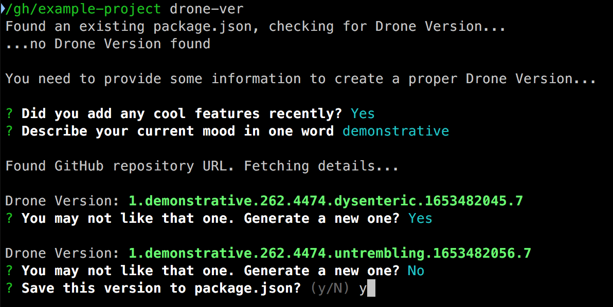

# Drone-Ver

A Node module and CLI for generating versions according to the [Drone-Ver][drone-ver] specification (a.k.a. the best way to version something).

If you have not read the drone-ver specification yet, why not? It's required reading for this module. **[Go and read it now][drone-ver].** Do not pass Go. Do not use [Go][golang]. Do not collect $200.

...

...

OK, all caught up now? Excellent, let us proceed.


## Usage

The simplest way to use drone-ver is via the command line.

```sh
npm install -g drone-ver

cd /path/to/your/node/project
drone-ver
```

This will ask you some important questions to generate a valid Drone Version, then optionally save it to your `package.json` under the `"droneVersion"` key. It will also query GitHub for some of the data so, um, make sure you have a network connection, I guess?



### Node module

For more control over the version, you can include Drone-Ver as a dependency.

```sh
npm install --save-dev drone-ver
```

Include it like any other module.

```js
var droneVer = require('drone-ver');
```


#### create()

Create a new Drone Version with your own data.

```js
var version = droneVer.create({
    major: 3,
    mood: 'whimsical',
    issues: 183,
    social: 5,
    dictionary: 'random',
    unixtime: Math.floor(Date.now() / 1000)
});
```

All data properties are optional. You're not allowed to specify the last part of the version — it is always 7.

The return value is an object with data properties for the parts of the version. But you're probably just going to want the full version string.

```js
version.major;  // 3
version.mood;   // 'whimsical'
version.seven;  // 7

version.toString();  // '3.whimsical.183.5.random.1446168078.7'
```


#### parse(versionString)

Parse a Drone Version string into an object with its component parts (as returned by `.create()`).

```js
var version = droneVer.parse('3.whimsical.183.5.random.1446168078.7');

version.mood;    // 'whimsical'
version.issues;  // 183
```

It will rightly complain if you try to give it a so-called "semantic" version.

```js
var version = droneVer.parse('2.1.5');
// TypeError: Woah, that version looks a bit too sensible to me
```


#### compare(version1, version2, options)

Compares two Drone Versions (either strings or objects). Return value:

* `-1` if `version1` is lower than `version2`
* `0` if the versions are equal
* `1` if `version1` is higher than `version2`

Comparison is done on the `unixtime` portion of the version, as defined by point 7 of the specification. If you want the MORE EXCITING comparison, pass `{moreExciting: true}` as the `options` parameter, and it will compare the versions based on their `dictionary` portions.

```js
var version1 = '1.sleepy.0.0.calamitous.1437363538.7';
var version2 = '2.joyous.0.0.armadillo.1446532221.7';

droneVer.compare(version1, version2);  // -1
droneVer.compare(version1, version2, {moreExciting: true});  // 1
```


## IAQ (Infrequently Asked Questions)

### Why would you use Drone Versioning for a project?

Pfft, why _wouldn't_ you?

### This is a joke, right?

You are within a labyrinth. At the exit gate are two guards. One always answers "yes" and the other always answers "no". You must choose which one to believe.

Alternatively, go find an ice cream to eat, or something. Sorry, what was the question again?


## Credits

Thanks to [Curtis Lassam][curtis] for writing [Cube Drone][cube-drone] and the original [Drone-Ver][drone-ver-comic].

Oh, and for [Horse Drawing Tycoon][horse-video].


[curtis]: https://twitter.com/classam
[drone-ver]: https://dronever.cube-drone.com/
[drone-ver-comic]: http://cube-drone.com/comics/c/version-sacrifice
[cube-drone]: http://cube-drone.com/
[horse-video]: https://www.youtube.com/watch?v=BRbcoXq_x2M
[golang]: https://golang.org/
